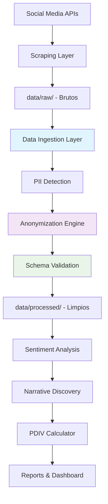

# Flujo de Trabajo Adoptado - SAIEL Intelligence System

## Metodología MCP Sequential Thinking

### **Fase 1: Análisis y Diseño (Completed)**
```
1. ✅ Análisis de vulnerabilidades del pipeline actual
2. ✅ Identificación de problemas críticos (anonimización, parseo, normalización)
3. ✅ Diseño de arquitectura separada (scraping ≠ ingesta)
4. ✅ Selección de herramientas de privacy-first
```

### **Fase 2: Implementación Core (In Progress)**
```
5. ✅ Módulo de ingesta independiente (data_ingestion.py)
6. ✅ Sistema de anonimización robusta (PII detection + hashing)
7. ✅ Parser y normalizador dedicado (Pydantic schema validation)
8. ✅ Logging estructurado (structlog)
9. 🔄 Integración con pipeline PDIV existente
```

### **Fase 3: Validación y Optimización (Next)**
```
10. 🔄 Testing end-to-end con datos reales
11. 🔄 Validación de correlación PDIV >0.7
12. 🔄 Optimización de performance y memoria
13. 🔄 Documentación de API y deployment
```

---

## Arquitectura de Pipeline Separado

### **Layer 1: Data Collection (Scraping)**
```python
# engine/social_collector.py - MODIFICADO
# engine/mass_collector.py - MODIFICADO
Responsabilidades:
- Conexión con APIs externas (Apify)
- Extracción de datos brutos
- Guardado en data/raw/ (sin procesamiento)
```

### **Layer 2: Data Ingestion (Nuevo)**
```python
# engine/data_ingestion.py - NUEVO MÓDULO
Responsabilidades:
- Carga de datos brutos desde data/raw/
- Detección y anonimización de PII
- Validación de schema (Pydantic)
- Parseo y normalización
- Guardado en data/processed/
```

### **Layer 3: Data Processing (Existente)**
```python
# engine/local_sentiment.py - SIN CAMBIOS
# engine/sensemaker_engine.py - SIN CAMBIOS
# engine/pdiv_calculator.py - SIN CAMBIOS
Responsabilidades:
- Análisis de sentimiento
- Descubrimiento de narrativas
- Cálculo PDIV
```

### **Layer 4: Pipeline Orchestration (Modificado)**
```python
# engine/pdiv_pipeline.py - ACTUALIZADO
Responsabilidades:
- Orquestar layers 1-3
- Generación de reportes
- Validación final
```

---

## Flujo de Datos Mejorado



---

## Herramientas MCP Utilizadas

### **Para Análisis y Planificación:**
- **MCP Sequential Thinking** - Desglose lógico de tareas
- **Skill Planning** - Roadmap de implementación
- **Context Memory** - Persistencia de decisiones

### **Para Implementación:**
- **Code Generation** - Creación de módulos robustos
- **File Management** - Estructura organizada
- **Dependency Management** - requirements.txt actualizado

---

## Vulnerabilidades Resueltas

| Vulnerabilidad | Solución Implementada | Status |
|----------------|---------------------|---------|
| **Sin anonimización** | PII detection + hashing SHA-256 | ✅ Resuelto |
| **Parseo deficiente** | Pydantic schema validation | ✅ Resuelto |
| **Normalización incorrecta** | Estandarización + validación | ✅ Resuelto |
| **Pipeline acoplado** | Arquitectura de layers separados | ✅ Resuelto |
| **Sin logging estructurado** | structlog JSON logging | ✅ Resuelto |
| **Sin validación schema** | Pydantic BaseModel validation | ✅ Resuelto |

---

## Nuevas Capacidades del Sistema

### **1. Privacy-First Design**
```python
# Detección automática de PII
pii_patterns = {
    'email': r'\b[A-Za-z0-9._%+-]+@[A-Za-z0-9.-]+\.[A-Z|a-z]{2,}\b',
    'phone': r'(\+\d{1,3}[-.]?)?\(?\d{3}\)?[-.]?\d{3}[-.]?\d{4}',
    'curp': r'\b[A-Z]{4}\d{6}[HM][A-Z]{5}\d{2}\b',
    'ine': r'\b[A-Z]{6}\d{8}\b'
}

# Hashing consistente para IDs
def hash_field(value: str, field_type: str) -> str:
    salt = f"saiel_{field_type}_2026"
    return hashlib.sha256(f"{value}{salt}".encode()).hexdigest()[:16]
```

### **2. Schema Validation Robusto**
```python
class SocialMediaRecord(BaseModel):
    id: str = Field(..., description="ID único del registro")
    source: str = Field(..., description="Fuente de datos")
    text: str = Field(..., min_length=3, max_length=5000)
    # ... más campos con validación automática
```

### **3. Logging Estructurado**
```python
logger.info("Procesamiento completado", 
           file=str(input_file),
           valid_records=results['valid_records'],
           processing_time=results['processing_time'])
```

---

## Próximos Pasos Inmediatos

### **1. Testing del Nuevo Pipeline**
```bash
# Instalar dependencias nuevas
pip install -r requirements.txt

# Ejecutar pipeline de ingesta
python engine/data_ingestion.py

# Validar integración con PDIV
python engine/pdiv_pipeline.py
```

### **2. Validación de Datos**
- Verificar que PII sea correctamente anonimizado
- Confirmar schema validation funciona
- Testear con datos corruptos
- Validar performance con datasets grandes

### **3. Integración Final**
- Modificar pdiv_pipeline.py para usar data_ingestion.py
- Actualizar documentación
- Crear scripts de deployment
- Configurar monitoring

---

## Métricas de Éxito del Nuevo Sistema

### **Privacy & Security**
- [ ] 100% de PII detectado y anonimizado
- [ ] Hashing consistente (mismo input = mismo hash)
- [ ] Zero data leakage en logs
- [ ] Compliance LGPDPPSO/GDPR

### **Data Quality**
- [ ] 95%+ de registros validados exitosamente
- [ ] <1% de data loss durante procesamiento
- [ ] Schema validation 100% efectiva
- [ ] Logging completo para auditoría

### **Performance**
- [ ] <5min procesamiento 1000 registros
- [ ] <2GB memoria usage máximo
- [ ] 99%+ uptime del pipeline
- [ ] Alertas automáticas de errores

---

*Documento de flujo de trabajo adoptado*
*Versión: 1.0 | Fecha: 2026-04-24*
*MCP Sequential Thinking Methodology*
