# System Design & Architecture Map

Este documento mapea la arquitectura estática extraída del directorio de código:
> `/home/fratfn/Desarrollo/godel-core/config`

## 1. Visual Dependency Graph (Mermaid)

```mermaid
graph TD
    memory_bank["memory_bank.py"]
    identity["identity.py"]
    sdlc_suite["sdlc_suite.py"]
    gateway["gateway.py"]
    anomaly["anomaly.py"]
    dashboard["dashboard.py"]
    dashboard --> identity
    dashboard --> gateway
    dashboard --> registry
    dashboard --> anomaly
    orchestrator["orchestrator.py"]
    orchestrator --> registry
    a2a_card["a2a_card.py"]
    security["security.py"]
    security --> registry
    registry["registry.py"]
    a2a_client["a2a_client.py"]
    a2a_client --> gateway
    mcp_servers["mcp_servers.py"]
    skills_composer["skills_composer.py"]
    approval["approval.py"]
    sandbox["sandbox.py"]
    workflow["workflow.py"]
    triggers["triggers.py"]
    triggers --> identity
```

## 2. Component Directory Analysis
Fueron escaneados y catalogados exactamente **17** archivo(s) Python.

### Component: `memory_bank.py`
- **Classes**: None
- **Key Functions/Methods**: `check_pii_violation`, `load_memory_bank`, `save_memory_bank`, `tool_query_memory`, `tool_commit_to_memory`
- **External Dependencies**: `re`, `json`, `pathlib`, `os`, `datetime`

### Component: `identity.py`
- **Classes**: `AgentIdentity`
- **Key Functions/Methods**: `__init__`, `_generate_cryptographic_signature`, `get_identity_string`
- **External Dependencies**: `json`, `pathlib`, `uuid`, `sys`, `hashlib`, `os`

### Component: `sdlc_suite.py`
- **Classes**: None
- **Key Functions/Methods**: `ensure_reports_dir`, `tool_refine_user_story`, `scan_python_file`, `tool_generate_system_design`, `tool_sequence_git_strategy`
- **External Dependencies**: `logging`, `re`, `json`, `pathlib`, `sys`, `os`, `typing`

### Component: `gateway.py`
- **Classes**: `AgentGateway`
- **Key Functions/Methods**: `__init__`, `screen_prompt`, `enforce_operational_policies`, `enforce_federation_safety`, `_record_violation`
- **External Dependencies**: `re`, `json`, `pathlib`, `sys`, `os`, `datetime`

### Component: `anomaly.py`
- **Classes**: `BehavioralAnomalyDetector`
- **Key Functions/Methods**: `__init__`, `reset_turn`, `record_step`, `record_tool_call`, `_log_anomaly`
- **External Dependencies**: `json`, `pathlib`, `sys`, `os`, `datetime`

### Component: `dashboard.py`
- **Classes**: None
- **Key Functions/Methods**: `tool_generate_security_posture_dashboard`
- **External Dependencies**: `config.identity`, `config.gateway`, `json`, `pathlib`, `config.registry`, `sys`, `os`, `config.anomaly`, `datetime`

### Component: `orchestrator.py`
- **Classes**: `CoordinatorOrchestrator`
- **Key Functions/Methods**: `load_specialist_registry`, `__init__`, `route_query`, `validate_tool_access`, `execute_handover`, `coordinate_task`, `tool_coordinate_specialists`
- **External Dependencies**: `logging`, `json`, `pathlib`, `config.registry`, `sys`, `os`, `typing`

### Component: `a2a_card.py`
- **Classes**: None
- **Key Functions/Methods**: `tool_publish_agent_card`
- **External Dependencies**: `sys`, `os`, `json`, `pathlib`

### Component: `security.py`
- **Classes**: None
- **Key Functions/Methods**: `is_path_allowed`, `is_writing_outside`
- **External Dependencies**: `google.antigravity.hooks`, `google.antigravity.utils.interactive`, `config.registry`, `os`, `google.antigravity`

### Component: `registry.py`
- **Classes**: `AgentRegistry`
- **Key Functions/Methods**: `deep_merge`, `load_merged_manifest`, `__init__`, `_load_approved_tools`, `validate_tool_call`, `audit_dependencies`
- **External Dependencies**: `sys`, `os`, `json`, `pathlib`

### Component: `a2a_client.py`
- **Classes**: None
- **Key Functions/Methods**: None
- **External Dependencies**: `config.gateway`, `json`, `pathlib`, `asyncio`, `os`

### Component: `mcp_servers.py`
- **Classes**: None
- **Key Functions/Methods**: None
- **External Dependencies**: `google.antigravity.types`

### Component: `skills_composer.py`
- **Classes**: `SkillsComposer`
- **Key Functions/Methods**: `__init__`, `load_declarative_skill`, `execute_composed_chain`, `tool_execute_composed_skills`
- **External Dependencies**: `typing`, `logging`, `json`

### Component: `approval.py`
- **Classes**: None
- **Key Functions/Methods**: None
- **External Dependencies**: `sys`, `asyncio`

### Component: `sandbox.py`
- **Classes**: `HostedSandboxExecutor`
- **Key Functions/Methods**: `limit_resources`, `__init__`, `validate_safety`, `execute_script`, `tool_run_sandboxed_code`
- **External Dependencies**: `resource`, `subprocess`, `logging`, `json`, `pathlib`, `sys`, `os`, `typing`, `tempfile`

### Component: `workflow.py`
- **Classes**: None
- **Key Functions/Methods**: `node_deterministic_compliance`, `node_ai_sentiment_quality`, `node_deterministic_diversity`, `node_ai_recommendation`, `tool_execute_electoral_workflow`
- **External Dependencies**: `logging`, `re`, `json`, `pathlib`, `os`, `typing`, `math`

### Component: `triggers.py`
- **Classes**: None
- **Key Functions/Methods**: None
- **External Dependencies**: `config.identity`, `json`, `pathlib`, `os`, `google.antigravity.triggers`, `datetime`

*Architecture report drafted dynamically by the System Architect Specialist agent.*
